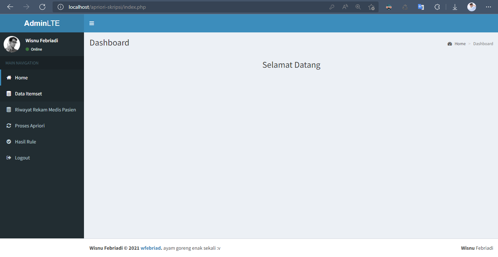

# Penerapan Association Rule Menggunakan Algoritma Apriori Pada Poliklinik Penyakit Dalam (Studi Kasus: Rumah Sakit Umum Daerah Bintan)

Aplikasi ini merupakan demo untuk sidang skripsi dengan judul
<h3> Penerapan Association Rule Menggunakan Algoritma Apriori Pada Poliklinik Penyakit Dalam (Studi Kasus: Rumah Sakit Umum Daerah Bintan) </h3>

Skripsi ini menjelaskan tentang penggunaan <a href="https://medium.com/@infharis/data-mining-definisi-dan-cara-kerja-algoritma-apriori-untuk-pencarian-association-rule-a44a8f864a61" target="_blank">Algoritma Apriori</a> pada penerapan <a href="https://www.ilmuskripsi.com/2016/06/association-rules.html" target="_blank">Association Rule</a>.  
Publikasi hasil penelitian ini dapat dilihat pada <a href="https://jsi.politala.ac.id/index.php/JSI/article/view/329" target="_blank">Halaman Berikut</a>.

<h3> Tampilan Aplikasi</h3>

